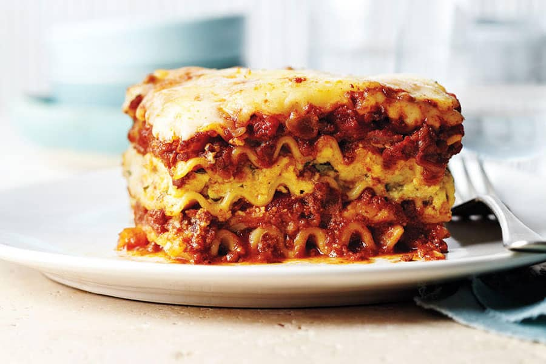

# The Best Homemade Lasagna

 
## Ingredients

### For the meat sauce:

- 2 teaspoons extra virgin olive oil
- 1 pound ground beef chuck
- 1/2 medium onion, diced (about 3/4 cup)
- 1/2 large bell pepper (green, red, or yellow), diced (about 3/4 cup)
- 2 cloves garlic, minced
- 1 (28-ounce)can good-quality tomato sauce
- 3 ounces tomato paste (half a 6-ounce can)
- 1 (14 ounce) can crushed tomatoes
- 2 tablespoons chopped fresh oregano, or 2 teaspoons dried oregano
- 1/4 cup chopped fresh parsley (preferably flat leaf), packed
- 1 tablespoon Italian seasoning
- 1 pinch garlic powder and/or garlic salt
- 1 tablespoon red or white wine vinegar
- 1 tablespoon to 1/4 cup sugar (to taste, optional)
- Salt

### To assemble the lasagna:

- 1/2 pound dry lasagna noodles (requires 9 lasagna noodles - unbroken)
- 15 ounces ricotta cheese
- 1 1/2 pounds (24 ounces) mozzarella cheese, grated or sliced
- 1/4 pound (4 ounces) freshly grated Parmesan cheese

## Method

### 1- Put pasta water on to boil

Put a large pot of salted water (1 Tbsp salt for every 2 quarts of water) on the stovetop on high heat. It can take a while for a large pot of water to come to a boil (this will be your pasta water), so prepare the sauce in the next steps while the water is heating.

### 2- Brown the ground beef

In a large skillet heat 2 teaspoons of olive oil on medium high heat. Add the ground beef and cook until it is lightly browned on all sides.

Remove the beef with a slotted spoon to a bowl. Drain off all but a tablespoon of fat. 

### 3-  Cook the bell pepper, onions, garlic, add back the beef

Add the diced bell pepper and onions to skillet (in the photo we are using yellow bell pepper and red onions).

Cook for 4 to 5 minutes, until the onions are translucent and the peppers softened. Add the minced garlic and cook half a minute more.

Return the browned ground beef to the pan. Stir to combine, reduce the heat to low and cook for another 5 minutes. 

### 4-  Transfer to medium sized pot, add tomatoes and remaining sauce ingredients to build the sauce

Transfer the beef mixture to a medium sized (3- to 4-quart) pot. Add the crushed tomatoes, tomato sauce, and tomato paste to the pot.

Add the parsley, oregano, and Italian seasonings, adjusting the amounts to taste. Sprinkle with garlic powder and/or garlic salt, to taste.

Sprinkle with red or white wine vinegar. Stir in sugar, a tablespoon at a time, tasting after each addition, to taste. (The amount of sugar needed will vary, depending on how acidic the tomatoes are that you are using.)

Add salt to taste, and note that you will later be adding Parmesan, which is salty.

Bring the sauce to a simmer and then lower the heat to maintain a low simmer. Cook for 15 to 45 minutes, stirring often. Scrape the bottom of the pot every so often so nothing sticks to the bottom and scorches.

Remove from heat. 

### 5-  Boil and drain the lasagna noodles

By now the salted water you started heating in step one should be boiling. Add the dry lasagna noodles and cook them to al dente, per package directions. (Note noodles may be cooked in advance.)

Stir often to prevent from sticking. Make sure that water remains at a full rolling boil during the entire cooking to prevent noodles from sticking.

When ready, drain in a colander and rinse with cool water, gently separating any noodles that may be sticking together.

Spread a little olive oil on a large rimmed baking sheet, and lay out the cooked noodles on this sheet, turning them over so that they get coated with a little of the olive oil. This will prevent them from sticking together. 

### 6- Heat the oven to 375°F

### 7-  Assemble the lasagna

In a 9x13-inch casserole or lasagna dish, ladle a cup of sauce and spread it over the bottom of the dish. Arrange one layer of lasagna noodles lengthwise (about 3 long noodles, edge may overlap, depending on your pan) over the sauce. Ladle a third of the remaining sauce over the noodles.

Sprinkle a layer of a third of the grated mozzarella on top of lasagna sauce. Add half of the ricotta cheese, by placing cheese dollops every couple inches. Sprinkle half the grated parmesan cheese evenly over the top of ricotta cheese.

Apply second layer of noodles, top it with half of the remaining sauce. Add half of the remaining Mozzarella, the remaining ricotta cheese, and another the remaining Parmesan.

Finish with another layer of noodles. Spread the remaining sauce over the top layer of noodles and sprinkle with the remaining Mozzarella cheese

### 8-  Bake

Cover the lasagna pan with aluminum foil, tented slightly so it doesn't touch the noodles or sauce). Bake at 375°F for 45 minutes. Uncover in the last 10 minutes if you'd like more of a crusty top or edges. 

### 9-  Cool and serve

Allow the lasagna to cool at least 15 before serving. Leftovers will keep for about 5 days. May be reheated in conventional oven or microwave. Leave aluminum tent on for storage. (Try to keep the aluminum foil from touching the sauce.) 

